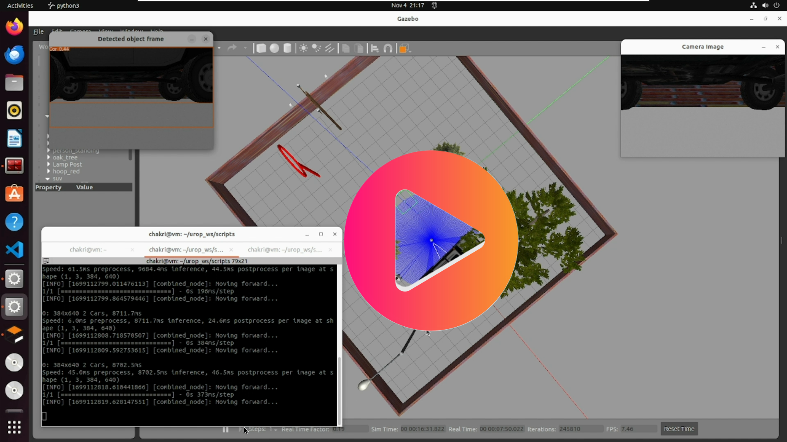
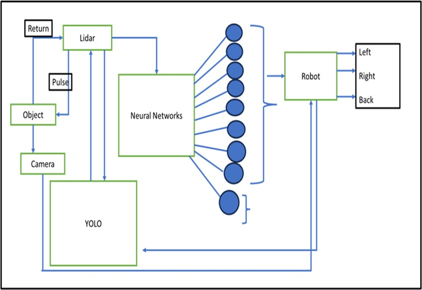
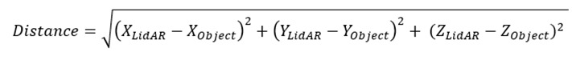
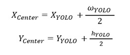
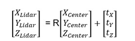
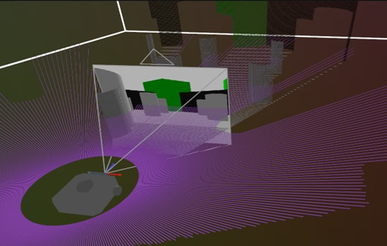
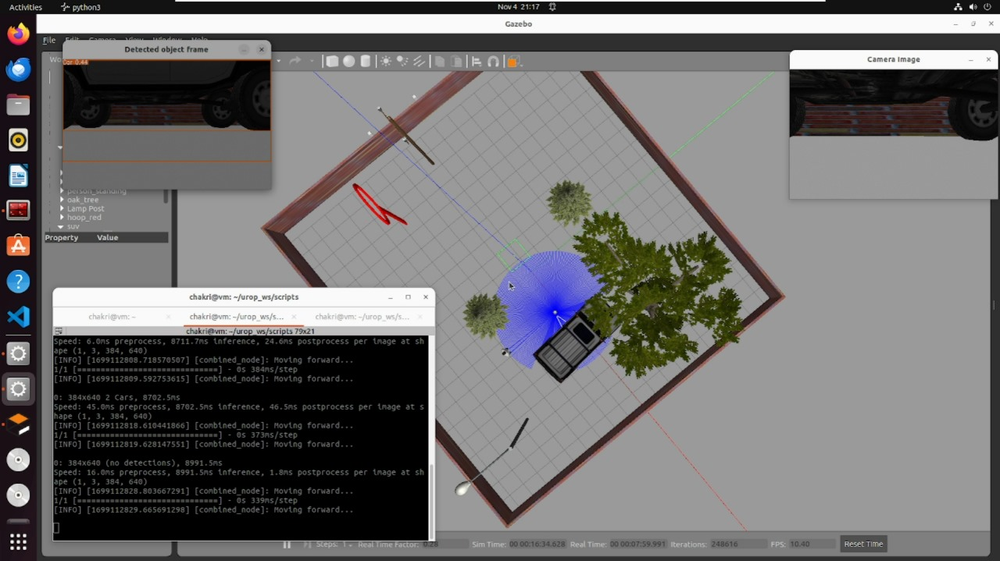

# Obstacle-Avoidance-in-Autonomous-Vehicles

<h3><b>Final Project Video</b></h3> 

<h1>Abstract</h1>

Humans are habituated to using vehicles, drones, robots, etc. They face issues like obstacles, so we use Collision avoidance. Collision avoidance is essential to autonomous systems in various industries like autonomous vehicles, robotics, and industrial automation. Effective Collision avoidance systems are crucial to enhancing safety and preventing accidents. We will highlight real-world collision avoidance applications, from self-driving cars navigating complex urban environments.

<h1>Introduction</h1>

Autonomous vehicles, often referred to as driverless vehicles, are at the forefront of technological innovation in the automotive industry. These vehicles have the remarkable capability to operate and perform essential functions without human intervention, thanks to their sophisticated sensor systems that enable them to perceive and react to their surroundings. The key to their operation lies in a fully automated driving system that allows the vehicle to respond to external conditions, much like a human driver would. Autonomous vehicles have the potential to transform various industries by enhancing efficiency, reducing costs, and improving safety. Here's how autonomous vehicles are being applied in logistics, industrial, consumer, and specialized purposes.

<h2>Applications of Autonomous Vehicles </h2>
<ul>
  <li>Logistics</li>
  <li>Industrial</li>
  <li>Consumer</li>
  <li>Transportation</li>
</ul>
<h1>Methodology</h1>
<h2>Dataset</h2>

We used YOLOv8 algorithm to detect objects for this we used Custom Dataset, For that Dataset we took images from

<a href="https://storage.googleapis.com/openimages/web/index.html">Google Open Image Dataset</a>
<h2>Real Time Implementation of Deep Learning Algorithms</h2>
<h3>Simulation of ROS2</h3>

I employed ROS 2 to integrate YOLOv8 with LiDAR data, enabling robust real-time object detection in a robotic system. Leveraging ROS 2's capabilities for sensor data fusion, I synchronized LiDAR scans with YOLOv8's object detection algorithms, allowing the robot to detect and track objects accurately in its surroundings. This integration empowered the robot with enhanced situational awareness, enabling it to navigate and interact with its environment more effectively.

